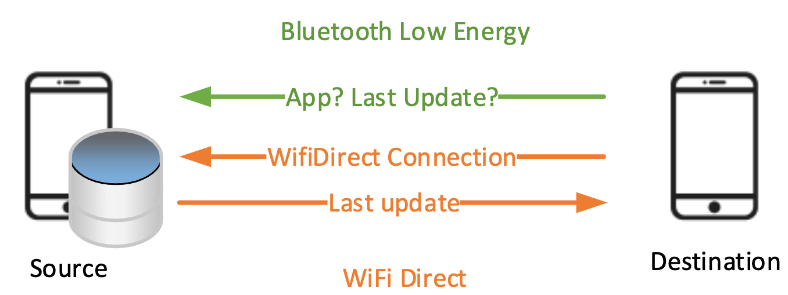

# DataHop Device-to-Device Android Library

This library implements a Device-to-Device (D2D) connectivity solution for Android devices used by the DataHop Network platform.
[DataHop](https://datahop.network) is a new platform aimed at exploring the potential of
a user-operated, smartphone-centric content distribution model
for user applications in contrast with the traditional client-server
model, that is used by the majority of mobile data transfers today.
In particular, we assume source nodes that are updated directly from the content provider (e.g., BBC, CNN), whenever
updates are available; destination nodes are then directly updated by source nodes in a D2D manner. We leverage on sophisticated information-aware and application-centric connectivity techniques to distribute content between mobile devices in densely-populated urban environments or rural areas where Internet connectivity is poor.

### Information-Centric and Application-Aware Connectivity

This library uses the WiFi Direct specification to exchange application content updates. WiFi Direct provides all the features required to provide smart connectivity between users and transfer content without infrastructure participation. 
However current Android WiFi Direct Android implementation still has one drawback: it requires user
participation to accept every connection. 
In order toavoid any user participation allowing DataHop to run in the background,
seamlessly to users, this library uses a hybrid mode according to which source devices create a WiFi Direct network using the previously described WiFi
Direct Autonomous Mode and destination devices connect to it as a
normal WiFi connection (legacy connection).

### BLE Content Advertisement
This library exploits the so-well known and stable [bluetooth low energy
(BLE)](https://developer.android.com/guide/topics/connectivity/bluetooth-le) beacons technology in order to exchange information related
to the device’s applications prior to the WiFi Direct connection, as
stated in the figure. This information may include the list of content
available, but also other metadata such as latest update of the content,
e.g., BBC-Sports-1100am or application name, transport protocol, port
number, etc. This way, users can share necessary application information before forming groups. The whole communication process does
not require user interaction and can be performed totally transparent
to the user. Also, the BLE beacon technology is a standard compatible
with not only any Android device but also with iOS devices and any
other wireless device compliant to the standard.

<p align="center"></p>

## Objectives

* [x] User devices must connect between them without infrastructure participation and without interrupting connectivity to the main infrastructure (e.g., WiFi access points or the
cell network).
* [x] User devices must discover services/applications
and content (available in nearby devices) before actually connecting to those devices. This will save both time and energy from the
process.
* [x] Connectivity should be transparent (and run as
a background process) to the user (i.e., it should not require the
users’ manual intervention.
* [x] Library should work on any Android device without requiring to 'root' the device
* [x] Connectivity must take into account power consumption and must implement mechanisms to avoid battery depletion.

# Installation

The library can be built manually using the following command:

```
$ ./gradlew localfirst:assembleRelease
```

and copy the generated .aar library into the `app/libs` folder of your app.


To add the library in your Android project first add the libs folder in your repositories list of the project `build.gradle` file,

```
allprojects {
    repositories {
    ....
      flatDir {
          dirs 'libs'
      }
    }
}
```

and then add the library as a depencency of your project in the app `build.gradle` file.

```
dependencies {
    ....
    implementation(name: 'localfirst-release', ext: 'aar')

}
```
The library can be also automatically imported via gradle: TBC


# Usage

This library can be used to sync files between devices using the same app using device-to-device. Users can create groups, add files within the groups and files are shared automatically between users totally transparent. 

## Start service

```
LocalFirstSDK.init(getApplicationContext());

LocalFirstSDK.start(getApplicationContext(),username,scan,scanTime,foregroundIdleTime,backgroundIdleTime,hotspotRestartTime, new LocalFirstListener(){
            @Override
            public void newFileReceived(String name) {
            ...
            }

            @Override
            public void newUSerDiscovered(String name) {

            ....
            }

            @Override
            public void newDataDiscovered(String data) {
            ....

            }
        });
```

## Stop service

```
LocalFirstSDK.stop(getApplicationContext());
```


## Add groups

```
LocalFirstSDK.addGroup(getApplicationContext(),userGroup)
```

## Add files

```
LocalFirstSDK.addFile(getApplicationContext(),filePath,userGroup)
```

# Demo file-sharing application

The repo includes a file sharing application in the [`demo-filesharing`](./demo-filesharing) folder using the d2d library. 

# License

Licensed under the Apache License, Version 2.0 (the "License"); you may not use this file except in compliance with the License. You may obtain a copy of the License at

   http://www.apache.org/licenses/LICENSE-2.0
Unless required by applicable law or agreed to in writing, software distributed under the License is distributed on an "AS IS" BASIS, WITHOUT WARRANTIES OR CONDITIONS OF ANY KIND, either express or implied. See the License for the specific language governing permissions and limitations under the License.

# Acknowledgment

This software is part of the NGI Pointer project "Incentivised Content Dissemination at the Network Edge" that has received funding from the European Union’s Horizon 2020 research and innovation programme under grant agreement No 871528

<p align="center"> </p>

